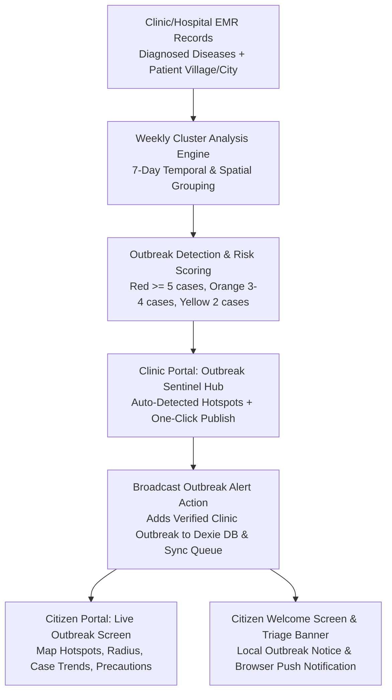

# Implementation Plan — Clinic/Hospital Outbreak Surveillance & Community Alert Publishing System

We will implement an **Epidemiological Outbreak Surveillance & Alert Contribution Hub** within the Clinical Triage & Hospital EMR Portal that automatically analyzes weekly diagnosed patient records by disease and geographic origin, allows healthcare facilities to publish verified outbreak alerts, and instantly pushes these alerts to the Citizen/User portal.

---

## 🏗️ Architecture & Component Workflow

---

## 📋 Detailed Implementation Steps

### 1. Epidemiological Analysis & Surveillance Service
*   **File**: `src/services/outbreakAnalyticsService.ts` [NEW]
*   **Capabilities**:
    *   `analyzeWeeklyClinicOutbreaks(clinicFacilityCode?: string)`: Scans all `clinicRecords` and `cases` over the past 7 days.
    *   Groups encounters by `(diagnosis, villageCity)` to detect geographic case clusters.
    *   Calculates 7-day case counts, growth trajectory vs previous 7-day baseline, and severity classification:
        *   🔴 **Red Alert (Confirmed Epidemic Outbreak)**: $\ge 5$ cases in the same locality within 7 days.
        *   🟠 **Orange Alert (Emerging Cluster)**: $3 - 4$ cases in the same locality.
        *   🟡 **Yellow Alert (Watchlist Surge)**: $2$ cases in the same locality.
    *   `publishOutbreakAlert(alertPayload)`: Saves a verified community alert to `db.alerts` with contributing clinic attribution, generates localized Gujarati/Hindi/English titles, and broadcasts browser notifications.

### 2. Clinic/Hospital Outbreak Sentinel Hub UI
*   **File**: `src/components/clinic/OutbreakContributionStation.tsx` [NEW]
*   **Features**:
    *   **Live Weekly Surveillance Dashboard**: Visual summary of weekly case counts, top infectious diseases, hotspot village map, and active surge indicators.
    *   **Auto-Detected Hotspots Table**: Lists detected clusters with one-click **"⚡ Publish Alert to Community"**.
    *   **Manual Outbreak Alert Broadcast Form**: Allows doctors to create a customized bulletin with disease name, affected area, radius, case count, contributing hospital verification badge, and localized preventive precautions.
    *   **Active Published Bulletins Manager**: Shows all alerts published by the hospital with option to update case count or resolve/close the outbreak.

### 3. Clinic Portal Navigation Integration
*   **File**: `src/components/clinic/ClinicPortal.tsx` [MODIFY]
*   Add a new tab **"Outbreak Sentinel"** (`outbreak_surveillance`) to the top clinic navigation bar with an active badge indicator if a disease surge is detected.

### 4. Citizen Portal Real-Time Outbreak Synchronization
*   **File**: `src/components/OutbreakScreen.tsx` [MODIFY]
    *   Ensure all clinic-contributed alerts are rendered with the **"Verified by Hospital EMR"** badge, showing the contributing facility name.
*   **File**: `src/components/WelcomeScreen.tsx` [MODIFY]
    *   Add an active **"🚨 Community Outbreak Alert"** marquee / banner on the citizen home screen when an active alert exists for their region.
*   **File**: `src/components/CaseTaking.tsx` [MODIFY]
    *   Display a contextual alert when a patient's reported symptoms match an active clinic-broadcasted outbreak in their locality.

---

## 🧪 Verification Plan

### Automated Tests
*   Run simulation scripts to test weekly encounter aggregation, geographic clustering, and threshold trigger logic.
*   Run `npm run lint` (`tsc --noEmit`) to ensure zero TypeScript errors.
*   Run `npm run build` to verify production bundle generation.

### Manual Verification
1. Open **Clinic Portal** -> **Outbreak Sentinel** tab.
2. Verify weekly analysis of EMR records grouped by disease and location.
3. Click **"Publish Outbreak Alert"** for a sample Dengue/Malaria hotspot in Anandpura.
4. Switch to **Citizen Portal** -> Observe live outbreak banner on Welcome Screen, inspect active alert in **Outbreak Center**, and verify hospital attribution badge.
